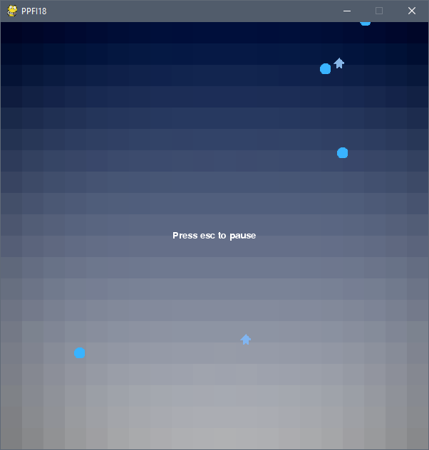

# People Playing Games
A game built on a simple custom pygame engine with multiplayer capabilities.

# Game

# Playing
* Run the server with `start_server.bat`
* Run the game from `play.bat`
  * Two players can connect at a time to the same server
* Movement
  * WASD to move
  * Point and click with the mouse to shoot circles
  * ESC to open menu to exit the game or quit to menu
# Config
Open `config.json` and modify options such as `missile_vel`, `player_vel`, `player_friction`, `cutoff_vel`, `shoot_cooldown`, and `move_cooldown` to test different moving and shooting speeds.

# Note on Pyngine
The game currently uses an older version of Pyngine, and has not been modified to be able to run with the newer versions.